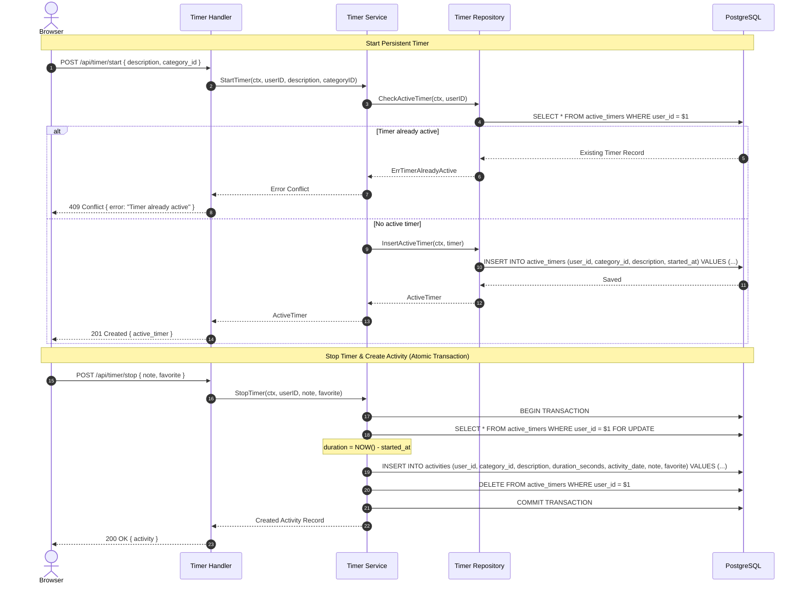

# Flow — Monolithic Architecture Specification

## 1. System Overview

**Flow** is designed as a **Modular Monolith** in **Go** backed by **PostgreSQL**.

The architecture emphasizes simplicity, high readability, standard library usage, and direct native execution on the developer workstation without requiring Docker in initial development.

```text
                 Browser Client
          (Vanilla HTML5 / CSS3 / ES6+ JS)
                         │
                         │ HTTP / JSON & HTML
                         ▼
        ┌───────────────────────────────────┐
        │            Go Monolith            │
        │                                   │
        │  ├── HTTP Router (net/http)       │
        │  ├── Security & Auth Middleware   │
        │  ├── Auth & Session Service       │
        │  ├── Category Service             │
        │  ├── Activity Service             │
        │  ├── Persistent Timer Service     │
        │  ├── Dashboard Analytics Service  │
        │  └── Embedded Web Assets          │
        └─────────────────┬─────────────────┘
                          │
                          │ SQL (database/sql + pq driver)
                          ▼
        ┌───────────────────────────────────┐
        │          PostgreSQL 15+           │
        │ (users, categories, activities,   │
        │  active_timers, sessions)         │
        └───────────────────────────────────┘
```

---

## 2. Layered Package Structure

The repository follows standard, idiomatic Go package layout:

```text
flow/
├── cmd/
│   └── server/
│       └── main.go                 # Server entrypoint, configuration & dependency injection
├── internal/
│   ├── config/
│   │   └── config.go               # Environment configuration loader
│   ├── database/
│   │   ├── db.go                   # PostgreSQL connection pool setup
│   │   └── migrate.go              # Embedded SQL migration runner
│   ├── models/
│   │   ├── user.go                 # User & Session domain models
│   │   ├── category.go             # Category domain model
│   │   ├── activity.go             # Activity domain model & filter DTOs
│   │   ├── timer.go                # ActiveTimer domain model
│   │   └── dashboard.go            # Dashboard analytics DTOs
│   ├── auth/
│   │   ├── handler.go              # Auth HTTP endpoints (register, login, logout, me)
│   │   ├── service.go              # Password hashing & session logic
│   │   └── repository.go           # User & session PostgreSQL queries
│   ├── categories/
│   │   ├── handler.go              # Category HTTP endpoints
│   │   ├── service.go              # Category validation & referential checks
│   │   └── repository.go           # Category PostgreSQL queries
│   ├── activities/
│   │   ├── handler.go              # Activity CRUD & search/filter endpoints
│   │   ├── service.go              # Activity business rules & validation
│   │   └── repository.go           # Dynamic search/filter SQL queries
│   ├── timer/
│   │   ├── handler.go              # Timer endpoints (get, start, stop, discard)
│   │   ├── service.go              # Single timer invariant & atomic stop transaction
│   │   └── repository.go           # Active timer PostgreSQL queries
│   ├── dashboard/
│   │   ├── handler.go              # Dashboard analytics endpoint
│   │   ├── service.go              # Aggregation math & metric transformations
│   │   └── repository.go           # Analytical SQL queries
│   └── http/
│       ├── router.go               # ServeMux routing & route mapping
│       ├── response.go             # Standardized JSON response helpers
│       └── middleware/
│           ├── auth.go             # Session validation & User context injection
│           ├── logging.go          # Request logging via log/slog
│           ├── recovery.go         # Panic recovery middleware
│           └── security.go         # Security headers middleware
├── web/
│   ├── templates/
│   │   └── index.html              # Core application HTML interface
│   └── static/
│       ├── css/
│       │   └── style.css           # Clean modern SaaS styling
│       └── js/
│           └── app.js              # Vanilla JS application controller & live timer
├── migrations/
│   ├── 001_create_users.sql
│   ├── 002_create_categories.sql
│   ├── 003_create_activities.sql
│   ├── 004_create_active_timers.sql
│   └── 005_create_sessions.sql
├── tests/
│   ├── unit/                       # Fast domain unit tests
│   └── integration/                # Database repository integration tests
├── docs/                           # Documentation suite
├── .env.example                    # Environment variable template
├── .gitignore
├── go.mod
├── go.sum
├── Makefile                        # Native development automation
└── README.md
```

---

## 3. Data Flow & Transaction Guarantees

### 3.1 Persistent Timer Lifecycle



### 3.2 Category Referential Protection
* Deleting a category that has logged activities is rejected before deletion occurs.
* The system queries `COUNT(*) FROM activities WHERE category_id = $1 AND user_id = $2`.
* If count > 0, an HTTP 409 Conflict error is returned with a clear user message.
