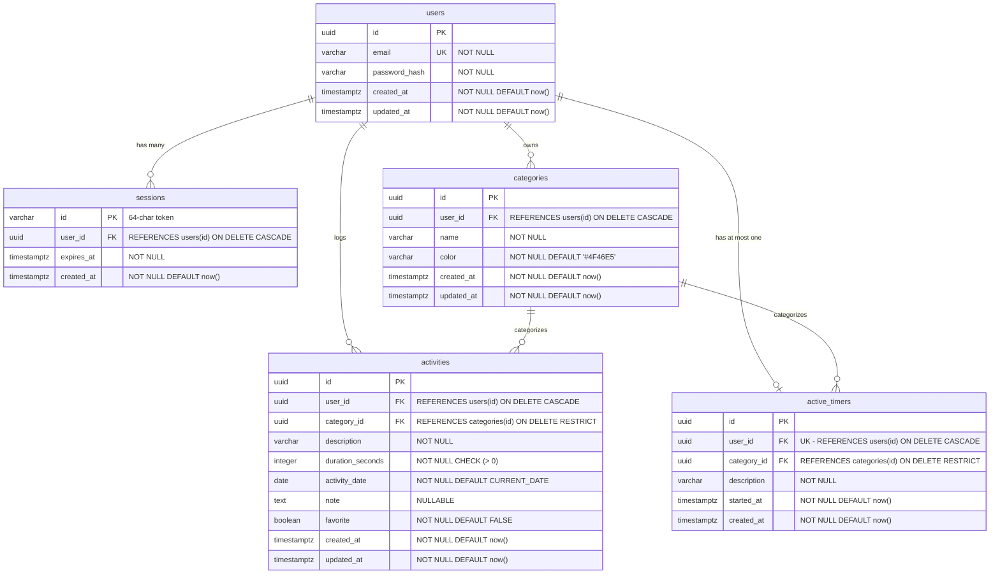

# Flow — Database Schema & Migrations

## 1. Database Overview

* **Engine**: PostgreSQL 15+
* **Primary Key Strategy**: UUID (`gen_random_uuid()`) for distributed safety and opaque IDs.
* **Duration Storage**: `INTEGER` representing duration in **seconds** (`duration_seconds`).
* **Timestamp Handling**: `TIMESTAMPTZ` (UTC ISO-8601).
* **Configuration**: Loaded exclusively via the `DATABASE_URL` environment variable.

---

## 2. Entity-Relationship Diagram



---

## 3. Table Definitions

### 3.1 `users`
```sql
CREATE TABLE IF NOT EXISTS users (
    id UUID PRIMARY KEY DEFAULT gen_random_uuid(),
    email VARCHAR(255) NOT NULL UNIQUE,
    password_hash VARCHAR(255) NOT NULL,
    created_at TIMESTAMPTZ NOT NULL DEFAULT NOW(),
    updated_at TIMESTAMPTZ NOT NULL DEFAULT NOW()
);
```

### 3.2 `categories`
```sql
CREATE TABLE IF NOT EXISTS categories (
    id UUID PRIMARY KEY DEFAULT gen_random_uuid(),
    user_id UUID NOT NULL REFERENCES users(id) ON DELETE CASCADE,
    name VARCHAR(50) NOT NULL,
    color VARCHAR(7) NOT NULL DEFAULT '#4F46E5',
    created_at TIMESTAMPTZ NOT NULL DEFAULT NOW(),
    updated_at TIMESTAMPTZ NOT NULL DEFAULT NOW(),
    CONSTRAINT uq_categories_user_name UNIQUE (user_id, name)
);
```

### 3.3 `activities`
```sql
CREATE TABLE IF NOT EXISTS activities (
    id UUID PRIMARY KEY DEFAULT gen_random_uuid(),
    user_id UUID NOT NULL REFERENCES users(id) ON DELETE CASCADE,
    category_id UUID NOT NULL REFERENCES categories(id) ON DELETE RESTRICT,
    description VARCHAR(255) NOT NULL,
    duration_seconds INTEGER NOT NULL CHECK (duration_seconds > 0),
    activity_date DATE NOT NULL DEFAULT CURRENT_DATE,
    note TEXT,
    favorite BOOLEAN NOT NULL DEFAULT FALSE,
    created_at TIMESTAMPTZ NOT NULL DEFAULT NOW(),
    updated_at TIMESTAMPTZ NOT NULL DEFAULT NOW()
);

CREATE INDEX IF NOT EXISTS idx_activities_user_date ON activities (user_id, activity_date DESC);
CREATE INDEX IF NOT EXISTS idx_activities_user_category ON activities (user_id, category_id);
CREATE INDEX IF NOT EXISTS idx_activities_user_favorite ON activities (user_id, favorite) WHERE favorite = TRUE;
```

### 3.4 `active_timers`
```sql
CREATE TABLE IF NOT EXISTS active_timers (
    id UUID PRIMARY KEY DEFAULT gen_random_uuid(),
    user_id UUID NOT NULL UNIQUE REFERENCES users(id) ON DELETE CASCADE,
    category_id UUID NOT NULL REFERENCES categories(id) ON DELETE RESTRICT,
    description VARCHAR(255) NOT NULL,
    started_at TIMESTAMPTZ NOT NULL DEFAULT NOW(),
    created_at TIMESTAMPTZ NOT NULL DEFAULT NOW()
);

CREATE INDEX IF NOT EXISTS idx_active_timers_user_id ON active_timers (user_id);
```

### 3.5 `sessions`
```sql
CREATE TABLE IF NOT EXISTS sessions (
    id VARCHAR(64) PRIMARY KEY,
    user_id UUID NOT NULL REFERENCES users(id) ON DELETE CASCADE,
    expires_at TIMESTAMPTZ NOT NULL,
    created_at TIMESTAMPTZ NOT NULL DEFAULT NOW()
);

CREATE INDEX IF NOT EXISTS idx_sessions_user_id ON sessions (user_id);
CREATE INDEX IF NOT EXISTS idx_sessions_expires_at ON sessions (expires_at);
```

---

## 4. Migration Files

Migrations are stored in the `migrations/` directory:

* `001_create_users.sql`
* `002_create_categories.sql`
* `003_create_activities.sql`
* `004_create_active_timers.sql`
* `005_create_sessions.sql`

Migrations are executed automatically on application startup by the embedded migration runner.
