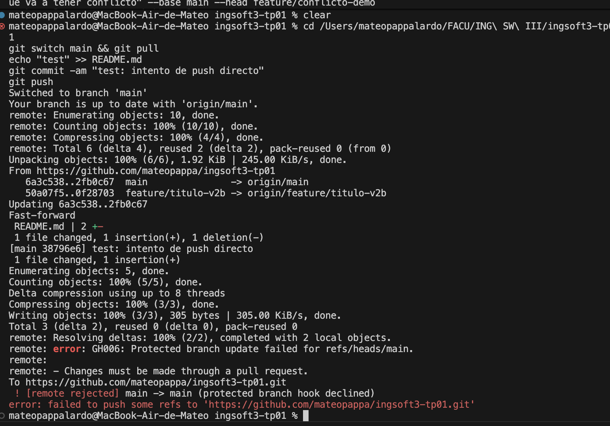
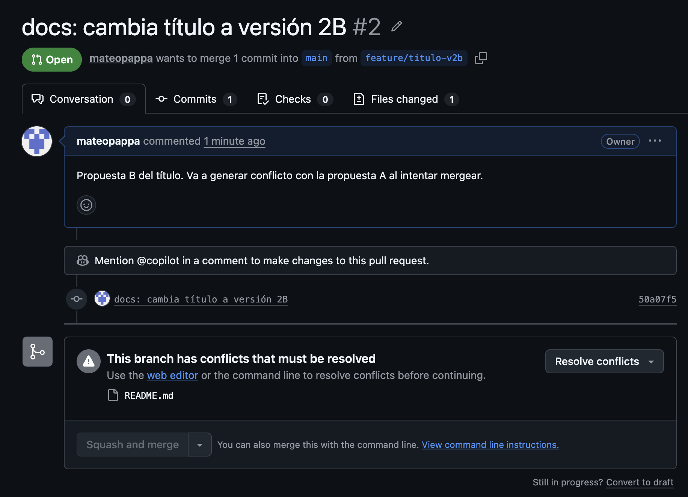
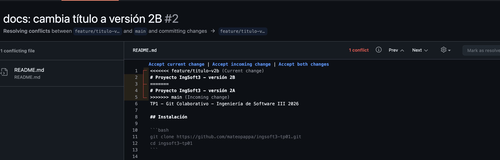
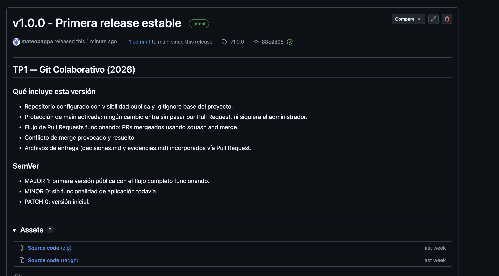

# Evidencias — TP1

## 1. Push directo a `main` rechazado



GitHub rechaza el push porque `main` está protegida con `enforce_admins: true`.
Esto significa que la regla alcanza también al dueño del repositorio: ningún cambio
puede entrar directamente a `main` sin pasar por un Pull Request.

---

## 2. PR de la rama B no se puede mergear: conflicto



El PR de `feature/titulo-v2b` quedó con conflicto luego de que el PR de
`feature/titulo-v2a` fue mergeado a `main`. GitHub muestra el aviso
**"This branch has conflicts that must be resolved"** porque ambas ramas
modificaron la misma primera línea del `README.md`.

---

## 3. Marcadores del conflicto en el archivo



Al hacer click en "Resolve conflicts", GitHub muestra el archivo con los marcadores
estándar de Git:

```
<<<<<<< feature/titulo-v2b
# Proyecto IngSoft3 - versión 2B
=======
# Proyecto IngSoft3 - versión 2A
>>>>>>> main
```

- La parte entre `<<<<<<<` y `=======` es la versión de la rama actual.
- La parte entre `=======` y `>>>>>>>` es lo que ya estaba en `main`.

Se resolvió manualmente eligiendo el contenido final, borrando los tres marcadores,
y commiteando el resultado.

---

## 4. Release `v1.0.0` publicada



La release `v1.0.0` fue publicada en GitHub con tag anotado sobre `main`.
URL: https://github.com/mateopappa/ingsoft3-tp01/releases/tag/v1.0.0
