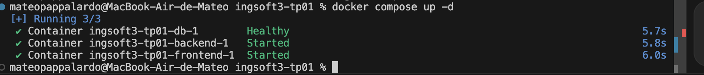
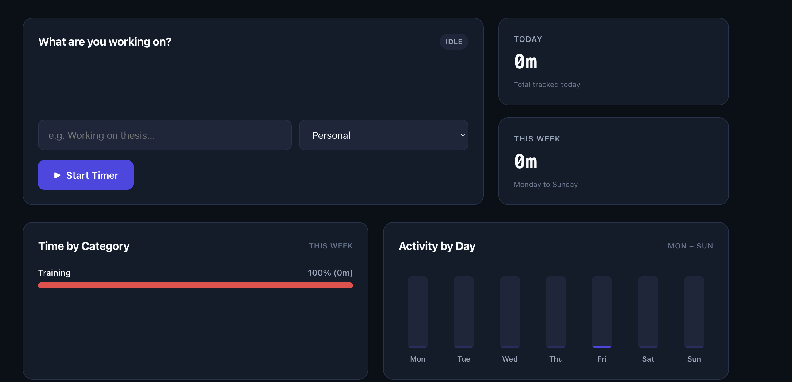
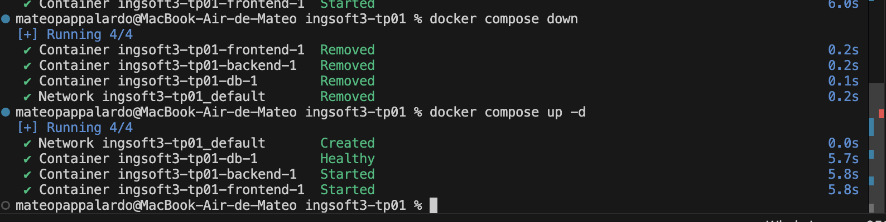
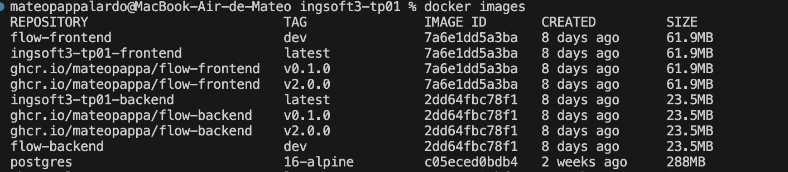
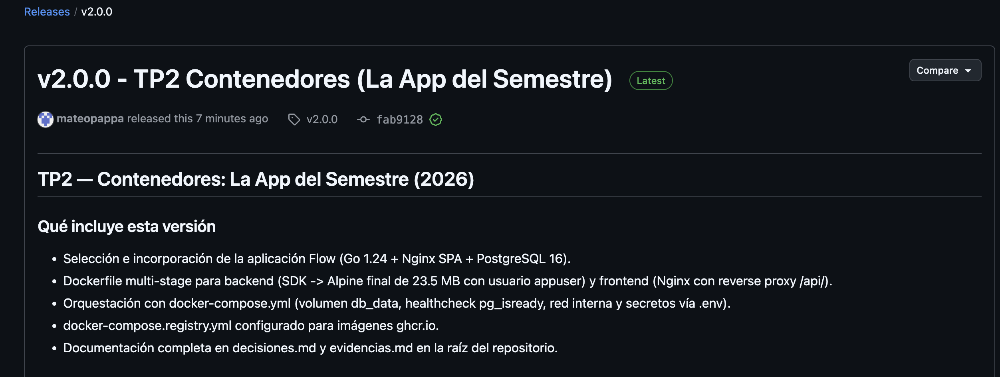

# Evidencias — TP1

## 1. Push directo a `main` rechazado


GitHub rechaza el push porque `main` está protegida con `enforce_admins: true`.
Esto significa que la regla alcanza también al dueño del repositorio: ningún cambio
puede entrar directamente a `main` sin pasar por un Pull Request.

---

## 2. PR de la rama B no se puede mergear: conflicto


El PR de `feature/titulo-v2b` quedó con conflicto luego de que el PR de
`feature/titulo-v2a` fue mergeado a `main`. GitHub muestra el aviso
**"This branch has conflicts that must be resolved"** porque ambas ramas
modificaron la misma primera línea del `README.md`.

---

## 3. Marcadores del conflicto en el archivo


Al hacer click en "Resolve conflicts", GitHub muestra el archivo con los marcadores
estándar de Git:

```
<<<<<<< feature/titulo-v2b
# Proyecto IngSoft3 - versión 2B
=======
# Proyecto IngSoft3 - versión 2A
>>>>>>> main
```

- La parte entre `<<<<<<<` y `=======` es la versión de la rama actual.
- La parte entre `=======` y `>>>>>>>` es lo que ya estaba en `main`.

Se resolvió manualmente eligiendo el contenido final, borrando los tres marcadores,
y commiteando el resultado.

---

## 4. Release `v1.0.0` publicada


La release `v1.0.0` fue publicada en GitHub con tag anotado sobre `main`.
URL: https://github.com/mateopappa/ingsoft3-tp01/releases/tag/v1.0.0

---

## TP2 — Contenedores: La App del Semestre

### 1. Sistema corriendo End-to-End con Docker Compose



Salida de `docker compose up -d` y estado de los contenedores (`docker compose ps`):

```text
[+] Running 4/4
 ✔ Network ingsoft3-tp01_default       Created
 ✔ Container ingsoft3-tp01-db-1        Healthy
 ✔ Container ingsoft3-tp01-backend-1   Started
 ✔ Container ingsoft3-tp01-frontend-1  Started

NAME                    IMAGE                   COMMAND                  SERVICE    CREATED          STATUS                    PORTS
ingsoft3-tp01-backend-1  flow-backend:dev        "/app/server"            backend    10 seconds ago   Up 9 seconds             0.0.0.0:8080->8080/tcp
ingsoft3-tp01-db-1       postgres:16-alpine      "docker-entrypoint.s…"   db         10 seconds ago   Up 10 seconds (healthy)  5432/tcp
ingsoft3-tp01-frontend-1 flow-frontend:dev       "/docker-entrypoint.…"   frontend   10 seconds ago   Up 9 seconds             0.0.0.0:3000->80/tcp
```

---

### 2. Prueba de Persistencia de la Base de Datos





- **Prueba 1 (Conservación de datos)**:
  Se cargaron datos de actividades en la app y luego se ejecutó `docker compose down`. Al reiniciar los contenedores con `docker compose up -d`, PostgreSQL volvió a montar el volumen `db_data` y las actividades registradas permanecieron intactas.
- **Prueba 2 (Limpieza total con `-v`)**:
  Al ejecutar `docker compose down -v`, Docker removió explícitamente el volumen `db_data`, restableciendo la base de datos a su estado inicial.

---

### 3. Comparación de Tamaño de Imágenes (Multi-Stage Build)



Salida de `docker images`:

```text
REPOSITORY                         TAG         IMAGE ID       CREATED        SIZE
ghcr.io/mateopappa/flow-backend    v2.0.0      2dd64fbc78f1   8 days ago     23.5MB
ghcr.io/mateopappa/flow-frontend   v2.0.0      7a6e1dd5a3ba   8 days ago     61.9MB
golang                             1.24-alpine (SDK Base)                    ~800MB
```

* **Resultado**: El backend multi-stage logra un peso final de **23.5 MB**, reduciendo más del 97% del tamaño en comparación con la imagen oficial de Go SDK (~800 MB).

---

### 4. Imágenes Publicadas en el Registry (GHCR) y Release `v2.0.0`



- **Imágenes en GHCR**:
  - `ghcr.io/mateopappa/flow-backend:v2.0.0`
  - `ghcr.io/mateopappa/flow-frontend:v2.0.0`
- **Release `v2.0.0`**: Publicada en GitHub con tag anotado sobre `main`.
URL: https://github.com/mateopappa/ingsoft3-tp01/releases/tag/v2.0.0


